# מילון ערבית מדוברת - מיפוי פיצ'רים לקראת MVP חדש

תאריך מיפוי: 2026-02-25

מסמך זה מרכז מיפוי פיצ'רים לא טכני מדי, עם צילומי מסך, קישורי Production אמיתיים, ומה המשתמש יכול לעשות בכל אזור במוצר.
המטרה היא תיעדוף לגרסה החדשה: מה חשוב, מה פחות חשוב, ומה אפשר לדחות לשלב מאוחר יותר.

גרסה חדשה מוצעת: **Django + Supabase + Vercel**
עיצוב קיים: [Lovable Modern Canvas](https://madrasa-modern-canvas.lovable.app/)

## סביבות

- Production: [https://milon.madrasafree.com/](https://milon.madrasafree.com/)
- Staging: [https://dev-milon.madrasafree.com/](https://dev-milon.madrasafree.com/)
- Local: [http://localhost:8081/](http://localhost:8081/)

## מה נסקר בפועל

- נקראו קבצי התיעוד המרכזיים: `AGENTS.md`, `docs/pages.md`, `docs/includes.md`, `docs/db.md`, `docs/handlers.md`, `docs/issues.md`, `docs/plan.md`, `docs/file-inventory.csv`.
- בוצע מעבר בדפדפן וצילום מסך עבור:
  - 67 מסכים ב־Localhost (כולל Team/Admin/Edit, wrappers, JSON/embed).
  - 30 מסכים ב־Production (ציבורי + בדיקות 404/חסימות).
- נוצר אינדקס מלא לכל הצילומים עם קישורים ישירים:
  - [ALL_PAGES_SCREENSHOTS.md](ALL_PAGES_SCREENSHOTS.md)
  - [screenshot_index.csv](screenshot_index.csv)
  - [screenshot_index_prod.csv](screenshot_index_prod.csv)

## היקף הסקירה

- Localhost: נסקרו `67` מסכים (ציבורי + Team + Admin + מסכי wrapper/embed/json).
- Production: נסקרו `30` מסכים ציבוריים ומסלולי מערכת.
- מתוך `67` עמודי `page` ב־inventory: תועדו `61` עמודי תצוגה שאינם משני־מצב.
- `6` עמודים משני־מצב הושארו מחוץ לניווט/צילום פעיל כדי לשמור על יציבות הנתונים בזמן התיעוד.

## מפת פיצ'רים לפי משתמש

### 1) משתמש ציבורי (ללא התחברות)

מה אפשר לעשות:

- לחפש מילה בעברית/ערבית/תעתיק.
- לצפות בדף מילה מלא (פירושים, מדיה, משפטים, קשרים).
- לגלוש לפי נושאים (Labels).
- לצפות במשפטים, רשימות, משחקי זיכרון, סטטיסטיקה ופעילות קהילה.

קישורי Production מרכזיים:

- בית וחיפוש: [https://milon.madrasafree.com/](https://milon.madrasafree.com/)
- דף מילה: [https://milon.madrasafree.com/word.asp?id=2939](https://milon.madrasafree.com/word.asp?id=2939)
- אינדקס נושאים: [https://milon.madrasafree.com/labels.asp](https://milon.madrasafree.com/labels.asp)
- דף נושא: [https://milon.madrasafree.com/label.asp?id=1](https://milon.madrasafree.com/label.asp?id=1)
- משפטים: [https://milon.madrasafree.com/sentences.asp](https://milon.madrasafree.com/sentences.asp)
- רשימות: [https://milon.madrasafree.com/lists.all.asp](https://milon.madrasafree.com/lists.all.asp)
- משחקים: [https://milon.madrasafree.com/games.mem.asp](https://milon.madrasafree.com/games.mem.asp)

צילומי מסך לדוגמה:

| מסך | צילום |
|---|---|
| בית / חיפוש |  |
| דף מילה | 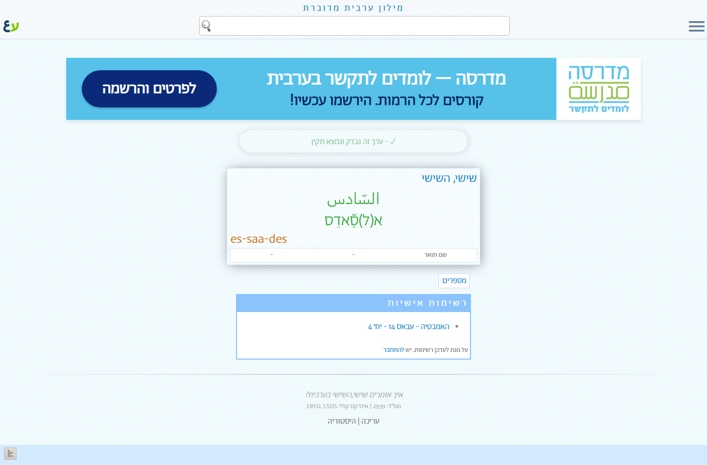 |
| אינדקס נושאים | 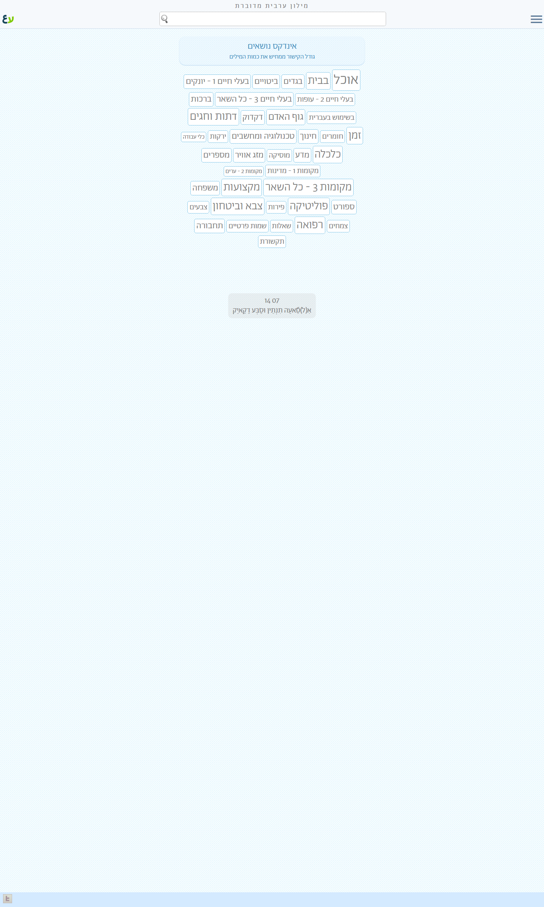 |
| משפטים | 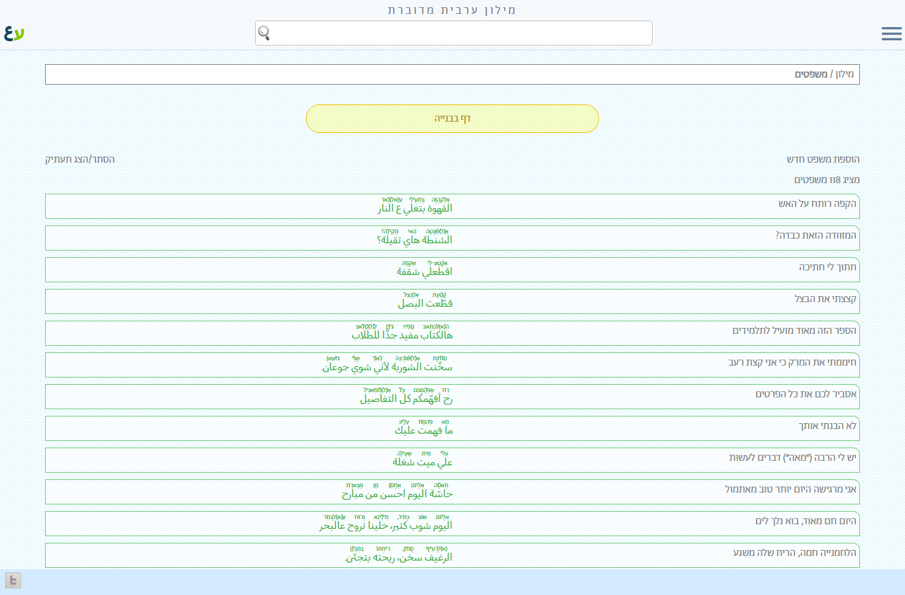 |
| רשימות | 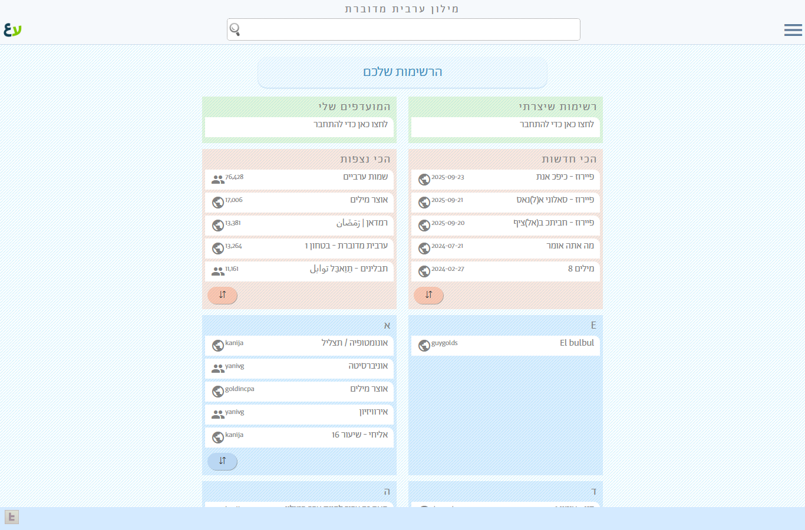 |
| משחק זיכרון |  |

### 2) משתמש תורם / צוות (אחרי Login)

מה אפשר לעשות:

- להוסיף מילה חדשה.
- לערוך מילה קיימת ולצפות בהיסטוריית שינויים.
- להוסיף/לערוך משפטים.
- ליצור/לערוך רשימות.
- לנהל מדיה (אודיו/וידאו) דרך ממשקי צוות.

קישורי Production מרכזיים (דורשים הרשאה):

- כניסה: [https://milon.madrasafree.com/login.asp](https://milon.madrasafree.com/login.asp)
- הוספת מילה: [https://milon.madrasafree.com/word.new.asp](https://milon.madrasafree.com/word.new.asp)
- עריכת מילה: [https://milon.madrasafree.com/word.edit.asp?id=2939](https://milon.madrasafree.com/word.edit.asp?id=2939)
- היסטוריית מילה: [https://milon.madrasafree.com/word.history.asp?id=2939](https://milon.madrasafree.com/word.history.asp?id=2939)
- הוספת משפט: [https://milon.madrasafree.com/sentenceNew.asp](https://milon.madrasafree.com/sentenceNew.asp)
- עריכת משפט: [https://milon.madrasafree.com/sentenceEdit.asp?sID=109](https://milon.madrasafree.com/sentenceEdit.asp?sID=109)
- מדיה צוות: [https://milon.madrasafree.com/team/mediaControl.asp](https://milon.madrasafree.com/team/mediaControl.asp)

צילומי מסך לדוגמה (משתמש מחובר בלוקאל):

| מסך | צילום |
|---|---|
| דף נחיתה למשתמש מחובר | 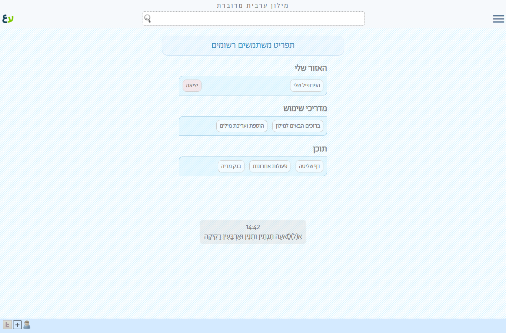 |
| הוספת מילה | 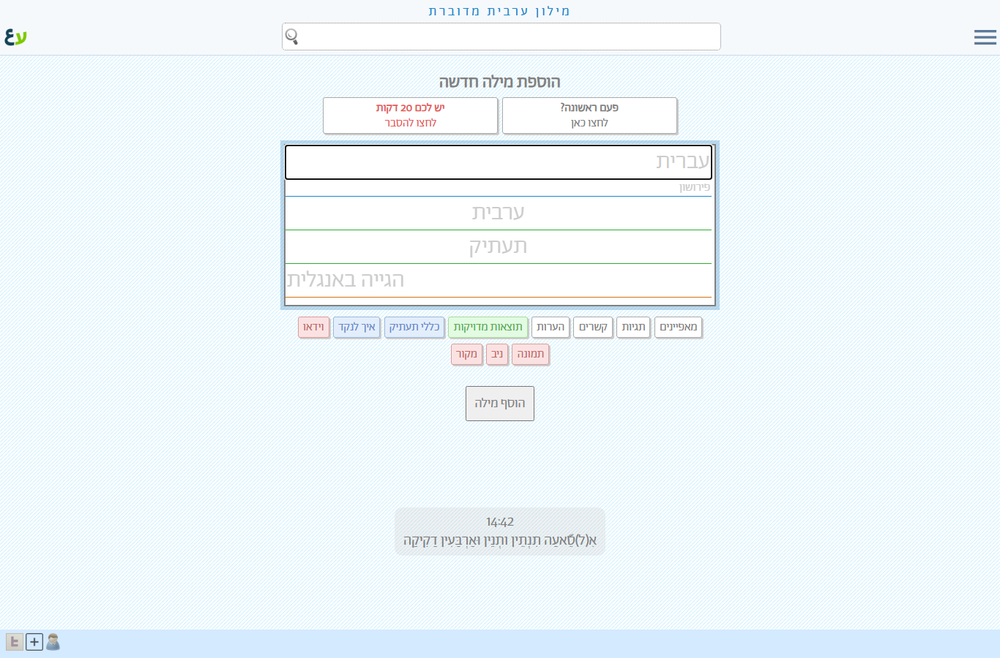 |
| עריכת מילה | 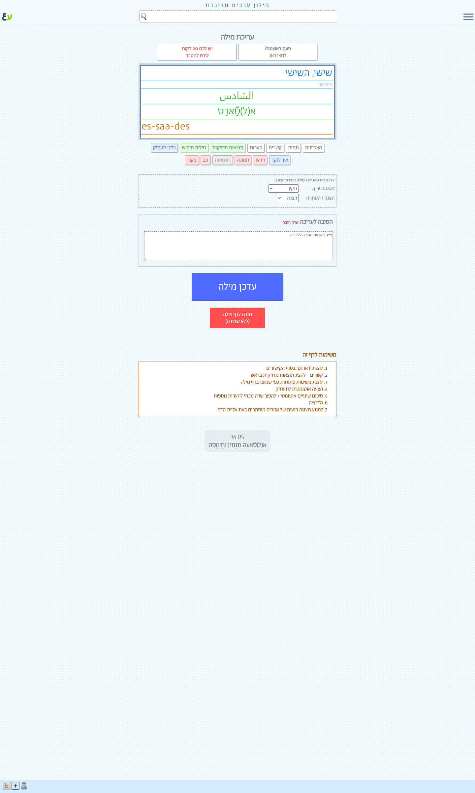 |
| היסטוריית מילה |  |
| הוספת משפט | 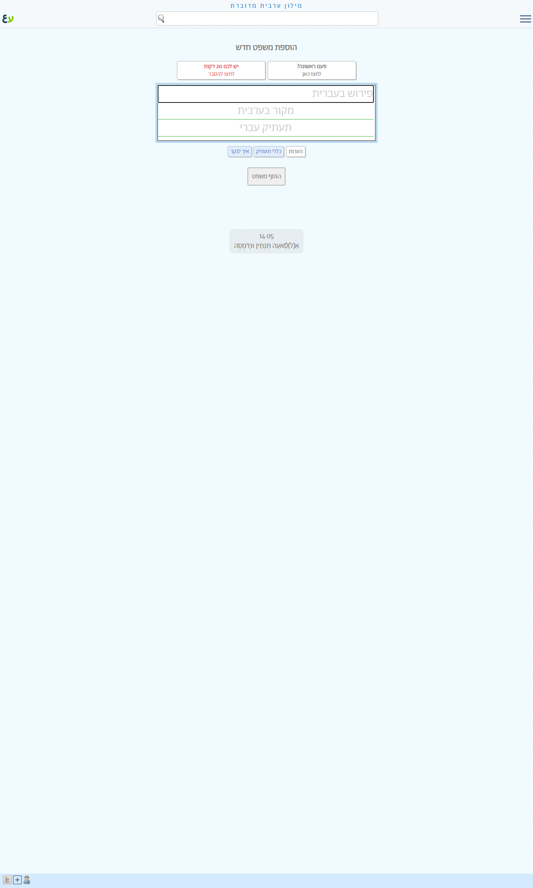 |
| ניהול מדיה |  |

### 3) מנהל מערכת (Admin)

מה אפשר לעשות:

- גישה ללוח אדמין.
- ניהול משתמשים (רשימות/עריכה/יצירה).
- ניהול תוויות.
- ניהול aliases לחיפוש קצר.
- ניהול נעילות עריכה.

קישורי Production מרכזיים (דורשים הרשאת Admin):

- אדמין ראשי: [https://milon.madrasafree.com/admin/](https://milon.madrasafree.com/admin/)
- ניהול משתמשים (מלא): [https://milon.madrasafree.com/admin/userControl.full.asp](https://milon.madrasafree.com/admin/userControl.full.asp)
- משתמש חדש: [https://milon.madrasafree.com/admin/userNew.asp](https://milon.madrasafree.com/admin/userNew.asp)
- עריכת משתמש: [https://milon.madrasafree.com/admin/userEdit.asp?id=1](https://milon.madrasafree.com/admin/userEdit.asp?id=1)
- ניהול תוויות: [https://milon.madrasafree.com/admin/labelControl.asp](https://milon.madrasafree.com/admin/labelControl.asp)
- נעילות: [https://milon.madrasafree.com/admin/locked.asp](https://milon.madrasafree.com/admin/locked.asp)

צילומי מסך לדוגמה (Local authenticated):

| מסך | צילום |
|---|---|
| דף אדמין ראשי | 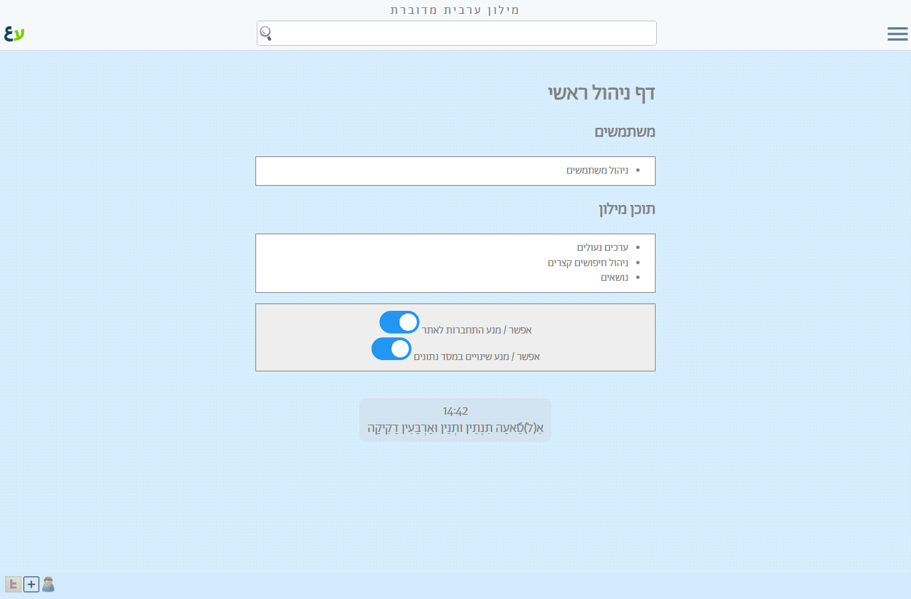 |
| ניהול משתמשים (Full) | 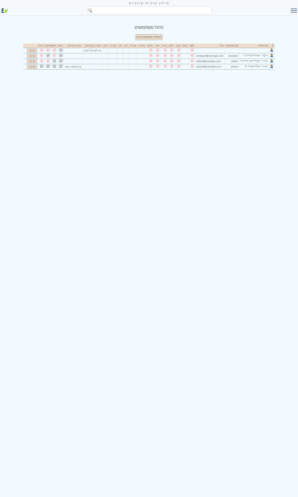 |
| משתמש חדש | 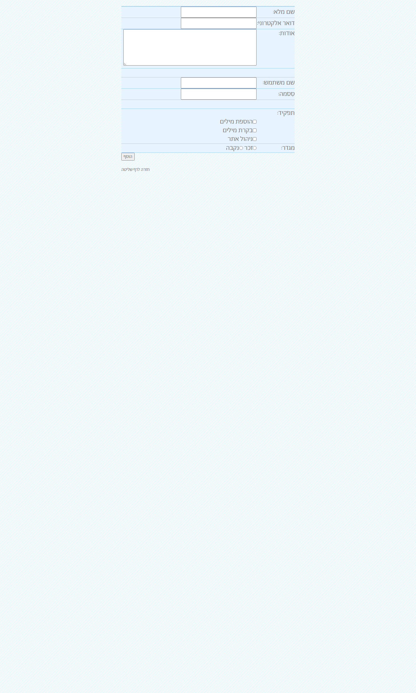 |
| ניהול תוויות |  |
| נעילות | 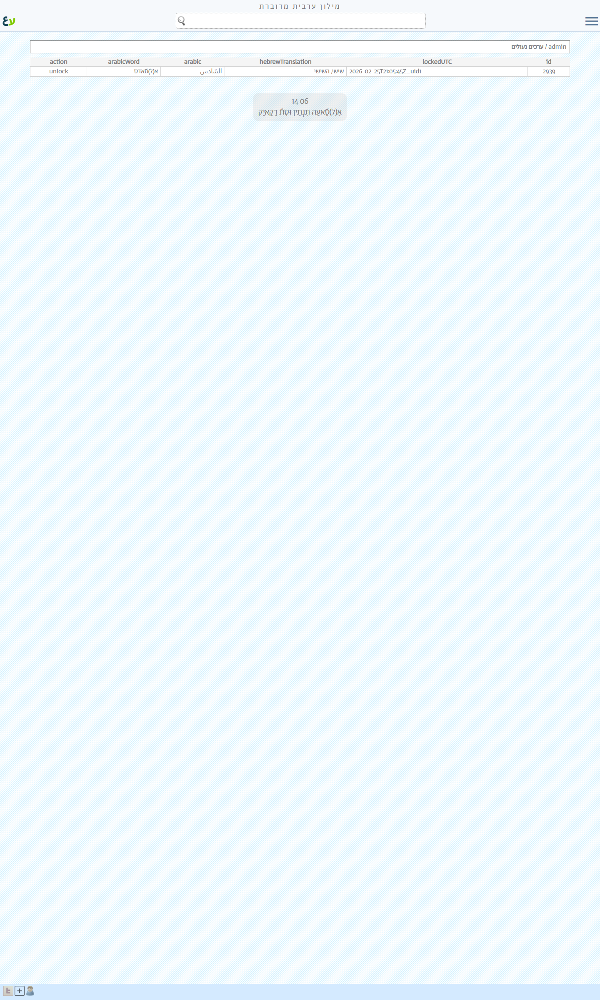 |

הערת סקופ:

- דפי toggle (`allowEditToggle` / `readOnlyToggle`) לא הופעלו בסקירה כדי לא לשנות מצב מערכת.
- עמודים משני־מצב (handlers) הושארו מחוץ לסקירה אינטראקטיבית, ומופיעים באינדקס תחת רשימת excluded.

## מסלולי מערכת חשובים (404 / חסימות)

מה אומת:

- מסך 404 מותאם אישית.
- חסימת גישה ל־`/docs/` מהחוץ.

צילומי מסך:

| מסך | צילום |
|---|---|
| 404 מותאם | 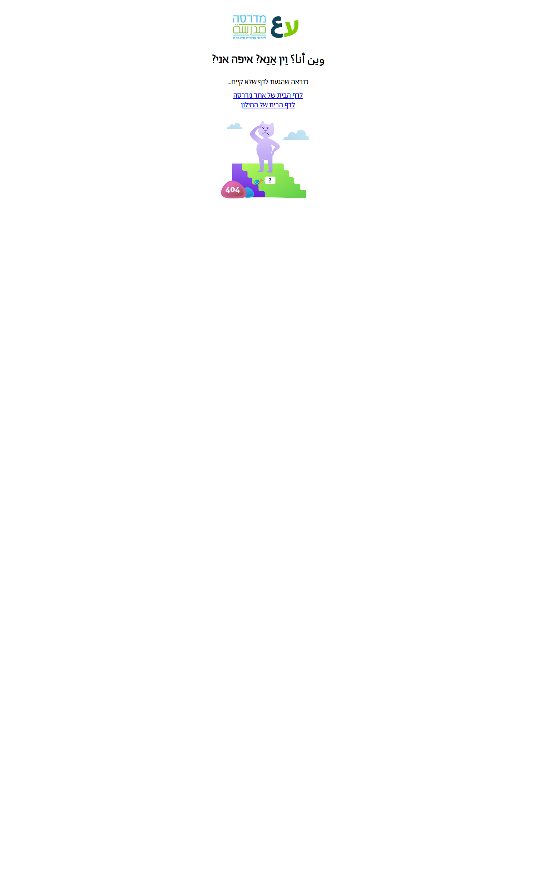 |
| חסימת docs | 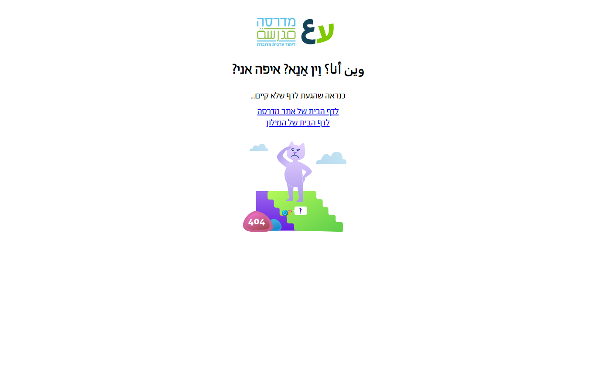 |

## תרגום ראשוני ל-MVP (גרסה חדשה)

מומלץ להתחיל ב־MVP עם פיצ'רים שמייצרים ערך מיידי ללומד:

- חיפוש + תוצאות + דף מילה מלא.
- Labels + דפי נושא.
- משפטים (צפייה) + רשימות (צפייה).
- פרופיל ציבורי בסיסי.
- התחברות צוות + הוספה/עריכת מילה.

פיצ'רים שכדאי לשלב בגל שני (מיד אחרי MVP):

- עריכת משפטים/רשימות מתקדמת.
- ניהול מדיה מלא.
- לוחות אדמין מורחבים.

פיצ'רים שניתן לדחות לגל שלישי:

- כלי אדמין legacy ספציפיים.
- מסכים תפעוליים עם מורכבות גבוהה ורווח משתמש נמוך.

## קבצים נלווים

- מיפוי מלא של כל המסכים: [ALL_PAGES_SCREENSHOTS.md](ALL_PAGES_SCREENSHOTS.md)
- אינדקס צילום לוקאל: [screenshot_index.csv](screenshot_index.csv)
- אינדקס צילום פרודקשן: [screenshot_index_prod.csv](screenshot_index_prod.csv)
- תבנית רמזור להחלטות MVP: [MVP_TRAFFIC_LIGHT_TEMPLATE.md](MVP_TRAFFIC_LIGHT_TEMPLATE.md)
